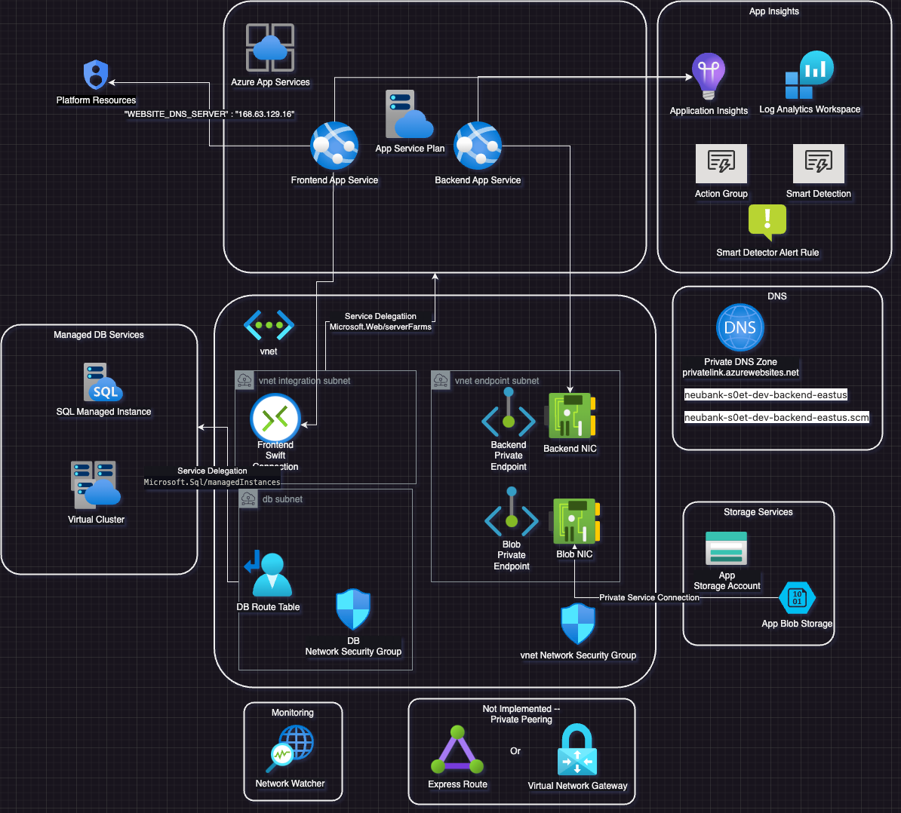

# Notes

## Arch Diagrams

`NeuBank.drawio.png` is a [draw.io](https://draw.io) diagram of all deployed resources done by hand.

This project also has some diagrams generated from graphviz files.

`overview.png` is an overview arch diagram of this project as described in the original instructions.

`overview.png`

This project generates architecture diagrams during deployment (so far just by piping the .dot from Terraform to graphviz and an image utility. Other options including [Rover](https://github.com/im2nguyen/rover) and [Mermaid](https://github.com/asannou/tfmermaid-action) exist.)

If a deployment is succesful and deployed the pipeline will run `terraform graph` and then convert the `.dot` to a `.png` and make something like `{env}_infrastructure.png`, to show what is currently deployed in an environment.

e.g.
`prod_infrastructure.png`

## `./bootstrap`

Anyone that forks this repo needs to `az login`. After that `make bootstrap` does a few things that mostly set everything up, provided a user has `PAT_TOKEN_VALUE` as an exported env var set to a Github Personal Access token that has access to read and write secrets in their repo.

### tfstate setup

tfstate is stored in Azure. The bootstrap directory and the `make bootstrap` command handle setting that up.

### github secrets

this repo's settings need the secrets populated with the values it needs to auth into azure. `make bootstrap` also handles that. It depends on the user setting `PAT_TOKEN_VALUE` in a local `.env` file that is sourced or just as an env var set and exported in their shell. As mentioned earlier, that token should be authorized to update secrets in the repo. The `make bootstrap` process also asks for a github username, provided a user has forked this and wants to get it working for them.

### other bootstrap considerations

to get going anyone that forks this repo also needs to run the `Add Terraform Workspaces` Github action after the previous bootstrap setup is done.  Terraform Cloud is a nice alternative to this that involves less of this bootstrapping and has many upsides, but it also has some downsides. This implementation does not use it.

## Env Branches

`main` -> deploys `prod`

`dev` -> deploys `dev`

`test` -> deploys `test`

This project makes use of auto tfvars and workspaces to handle the environments. The pipelines are set accordingly to handle the environments.

Environments can be enabled (set to deploy) or disabled (will destroy if was deployed before) in the `prod.tfvars`, `dev.tfvars`, and `test.tfvars` files with `enable = true`. It defaults to `false`.

## Pipelines

This project uses github actions. The pipeline for every environment branch does the following.

- switches to the workspace for the env
- runs a tfplan and some formatting checks and checkov if it is a pull request
- runs a plan -auto-approve if it is a push
- it also updates the diagrams for that environment with `terraform graph` and pipes it to `graphviz` and does some other stuff to make it a .png and commit and push it back into the repo.

## Subnets
This uses a vnet and subnets. The subnets are:
- Integration (CIDR "10.0.1.0/24")
- Endpoint (CIDR "10.0.2.0/24")
- Database (CIDR "10.0.3.0/28" included in the db module)

## DB
This uses a managed mssql db on Azure. It can take 30 minutes or more to bring that resource up.

-----

# Senior Cloud Infrastructure Consultant
## Take Home Exercise

The NeuBank Mortgage is an online mortgage company that offers home loans for new home buyers. As part of their platform modernization effort, they recently upgraded their mortgage calculator to provide a better digital experience for customers.

The application was implemented using a three-tier architecture: presentation, application, and data. 
As a cloud infrastructure architect, you’ve been asked to provision the required Azure services using Infrastructure as Code (IaC) tools to deploy the latest version of the mortgage calculator in their Dev environment. Below are the requirements:

•	Deploy the application to the East US region.

•	Deploy resources to a resource group named dev-rgp-cis-neubank-use-001.

•	Create an App Service to deploy the frontend part of the application.

•	Create an App Service to deploy the backend API part of the application.

•	Create an Azure SQL database to store calculations from the mortgage calculator.

•	Set up Blob Storage for media and related content.

•	Configure App Insights to record telemetry data from the application.

•	The application and data tiers should only be accessible inside a virtual network. They should not be exposed to the public internet and should only be accessible by the presentation tier.

•	All Azure resources should have the following tags:

o	Environment = Dev

o	Owner = first.last@company.com

o	Project = Mortgage Calculator

Deliverables

•	Create IaC templates for the above requirements, preferably using Azure Bicep or Terraform.

•	The IaC templates should support multi environment deployments (Dev, Test, Prod).

•	Publish IaC templates to a public GitHub repository with a regular commit history.

•	Demonstrate IaC template execution using CI/CD, preferably using GitHub Actions or Azure DevOps Pipelines.

•	Create an architecture diagram for the above deployed infrastructure.

FAQ

Do I need an Azure subscription?

Yes, you need an Azure subscription to provision and test the infrastructure services using IaC. We recommend creating a free Azure account. 

A free Azure account gives you a $200 credit to spend in the first 30 days. In addition, you get free monthly amounts of two groups of services: popular services, which are free for 12 months, and more than 55 other services that are always free. For more details see https://azure.microsoft.com/en-us/pricing/free-services.

Do I need to delete my resources?

Yes, please delete the provisioned Azure resources after testing to avoid unnecessary charges.
What type of Azure SKUs should I use for provisioning resources?

Since this is just a coding exercise, we recommend using the basic tier SKUs.

